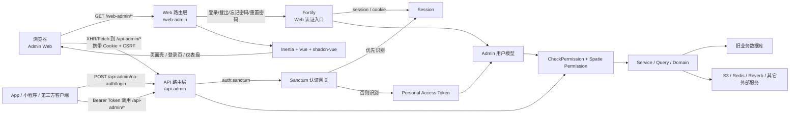
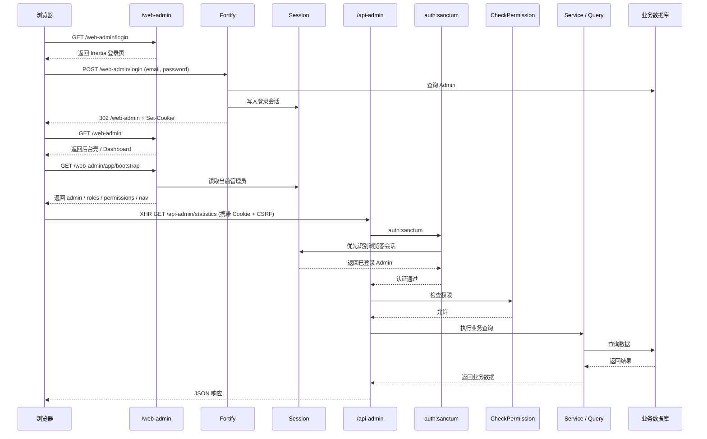
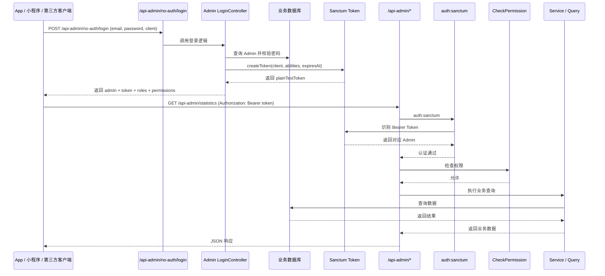

# Admin Web 长期架构说明

本文档说明当前项目中 `/web-admin`、`/api-admin`、Fortify、Sanctum 与 App / 小程序 / 第三方客户端之间的推荐长期关系。

## 总体关系图

## 时序图

### 浏览器登录并访问 `/api-admin/*`

### App 使用 Token 访问 `/api-admin/*`

## 分层职责

- `/web-admin/*`
  - 负责页面、登录页、后台壳、Inertia 页面跳转。
  - 认证方式是 `Fortify + Session/Cookie`。
  - 浏览器端不持久化后台 Bearer Token。

- `/api-admin/*`
  - 负责业务数据读写与管理端接口能力。
  - 当前仍保持 API 语义与 JSON 返回风格。
  - 浏览器访问时通过 `auth:sanctum` 识别 Session。
  - App / 小程序 / 第三方客户端访问时继续使用 Bearer Token。

- `Fortify`
  - 只负责浏览器 Web 的登录、登出、忘记密码、重置密码等认证入口。
  - 不负责移动端或第三方客户端 token 签发。

- `Sanctum`
  - 作为统一认证网关保护 `/api-admin/*`。
  - 优先识别浏览器 Session / Cookie。
  - 若无 Session，再识别 Bearer Token。

- `Service / Query / Domain`
  - 作为页面层与接口层共用的业务能力层。
  - 页面控制器和 API 控制器不应各自重复实现业务逻辑。

## 推荐长期原则

- 页面层与 API 层分开：
  - 保留 `/web-admin/*`
  - 保留 `/api-admin/*`

- 认证入口分开：
  - 浏览器后台使用 `Fortify + Session`
  - App / 第三方继续使用 `Sanctum Token`

- 受保护业务接口合并：
  - `/api-admin/*` 继续作为统一能力层
  - 浏览器后台与外部客户端共享同一套受保护 API

- 权限和业务逻辑合并：
  - 权限判断仍以后端 `CheckPermission + Spatie Permission` 为准
  - 前端权限只做菜单与按钮展示裁剪

## 为什么不建议把 `/web-admin` 和 `/api-admin` 硬合并

- 不建议合并 URL 空间：
  - 页面路由与数据接口混在一起后，可读性和可维护性都会下降。
  - 现有 App / 外部客户端已经依赖 `/api-admin/*`，改路径成本高。

- 不建议合并控制器职责：
  - 一个控制器同时返回 Inertia 页面和 JSON，后续会越来越难维护。
  - 页面 props、JSON 响应、权限、异常格式会互相耦合。

- 可以合并的是认证网关与底层能力：
  - 浏览器走 Session
  - 客户端走 Token
  - 业务接口统一走 `/api-admin/*`

## 当前项目的推荐长期形态

- URL 不合并
- 控制器不合并
- 认证网关合并
- 业务逻辑合并

也就是：

- `/web-admin/*` 负责页面
- `/api-admin/*` 负责数据接口
- `auth:sanctum` 同时支持浏览器 Session 和 Bearer Token
- 页面层与 API 层共同复用底层 Service / Query / Permission

## 一句话建议

对当前项目而言，最合适的长期架构是：

**页面层分开，API 层分开，认证网关统一，业务能力复用。**

这样既能保证浏览器后台体验最自然，也不会破坏现有 App / 小程序 / 第三方客户端的接入方式。
